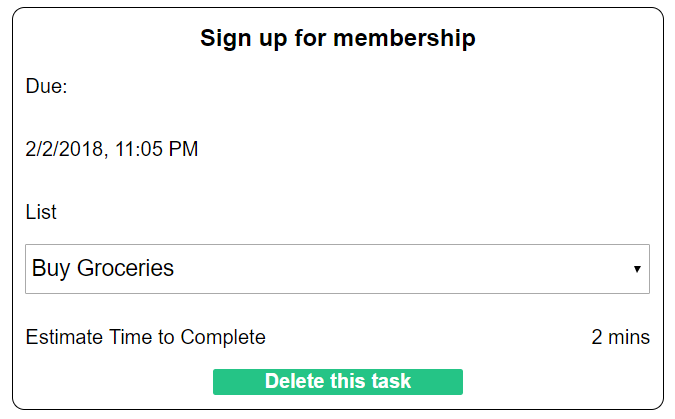

# Lilypad

[Lilypad live][heroku]

[heroku]: http://www.lilypadtodo.com

Lilypad is a full-stack web application that takes cues from
Remember the Milk. Its design allows users to hop from task to task with ease and keep track of what they accomplished. Using this site will allow users to increase their productivity by allowing them to not focus on remembering all of the tasks they need to get done.


## Features & Implementation

### List and Task Rendering and Editing

  The database is responsible for keeping track of the lists and tasks associated with the current user. The table storing the data for the lists contains the columns `id`, `author_id`, `title`, `due`, and `completed`. The table for the tasks works very similarly to the lists table but they have a `list_id` and `author_id` in order to make it easier to fetch all tasks or just the tasks associated with a list. When logged in, the backend will filter the lists and tasks such that only the ones belonging to the current user are available.

  ```ruby
    @lists = current_user.lists
    if @lists
      render :index
    else
  ```

  Current user is accessible to the backend by means of setting the session token of the user attempting to log in to the session cookie on the window. With this piece of information, the current user can be fetched by means of a query for the user who has a session token equal to the one on the window.

  ```ruby
  def current_user
    return nil unless session[:session_token]
    User.find_by(session_token: session[:session_token])
  end
  ```

  Lists are rendered only in the navigation bar which appears at the side of the page. You can see all of the tasks in a list, add a task to a list, or checkoff a task in a list by simply clicking the desired list. To create a list, press the plus sign icon at the top of the navigation bar. This will cause a pop up to come on to the page and ask for the name and title of the new list. The site will enforce the fact that you can't make lists that are due in the past, so be careful. Once the list is on the navigation bar, the user is given the options to edit the name or title of the list by clicking the cog icon seen beside each list title in the navigation bar. If you click delete, the entire list will be erased and so will all of the tasks that existed in that list. If you press edit, a popup similar to the add list popup will appear and allow you to edit that list's title and due date. The add and edit list modal are actually the same, repurposed component that looks like this.

  ```html
  <div className="modal-screen" onClick={ this.props.toggleModal }>
    <div className="modal-content" onClick={ (e) => e.stopPropagation() }>
      <h1>{ title }</h1>

      { titleErrors }
      { dueErrors }
      <form onSubmit={ this.handleSubmit }>

        <input type="text"
          value={ this.state.title }
          placeholder="Title"
          onChange={ this.update("title") }/>

        <label> Due:
          <input type="date"
            value={ new Date(this.state.due).toISOString().substring(0,10) }
            onChange={ this.update("due") } />
        </label>

        <input id="list-sub" type="submit"/>
      </form>
    </div>
  </div>
  ```

  The outer div has a click handler that closes the whole modal, making for an intuitive user experience. The inner modal has the form that you can actually input your list title and due date into.

   The real information lies in the showing of the tasks for each list, which is handled in `TaskIndex`. Above `TaskIndex` is the `ListTitle`, which acts a summarized show page for the currently selected list, including the tile, the estimated time, and how many tasks have been completed. In this component, users can create new tasks with an input field that, when clicked, produces an entire form to collect all of the information for the new task. This helps keep the task_index clean.

  One can see a task merely by clicking on the list element which is labeled with the name of the task. This causes an animated window to come in from the right. This animation was implemented using CSS3. This element looks like the following.



  The task index moves over the list title show area, which keeps the page clean and focused. This window shows all of the task information, including title, due date/time, and estimated time to completed the task. In this window, the user can edit the title by clicking on it and delete it with the button at the bottom.  Another feature is the ability to move a task from list to list. This is done by clicking on the dropdown which prominently displayed in the task show component. By clicking one of the lists, the user can move the task to the selected list.


### Search

In the header of the page, one can see a green search bar. If you were to type the name of a task in the bar and press return, the task index page will be replaced with the search results of looking for that task in the currently selected list. This is done by filtering the state to include only tasks that include the state search parameters.

```javascript
  let tasks = state.tasks;
  if(ownProps.location.pathname.indexOf("search") >= 0) {
    let allTasks = Object.keys(state.tasks).filter(taskId => taskId !== "errors").map(taskId => state.tasks[taskId]);
    if(state.searchParams){
      tasks = allTasks.filter((task) => (
        task.title.toLowerCase().indexOf(state.searchParams.searchParams.toLowerCase()) >= 0
      ));
    }
  }
```

To look for a list in all of your tasks, simply implement the search while in the all tasks route provided. Keep in mind that the search is case insensitive. This is incredibly useful for the quick look up of one of you known tasks to make sure you know when its due.

### Future Updates

In the future, the app will be able to handle sub-tasks, effectively making a task a list. This will allow for users to get more and more specific with what they are trying to accomplish. I also would like to add smart task adding to the site. With this feature, users would just need to add certain key words to the title input section for a task to change that property for the new task. For example, after typing the title, I may write "date =". This would cause a calendar dropdown to appear, but the user could just type out the date and it would automatically be converted to a date for the new task. This would make adding tasks much simpler and faster.
