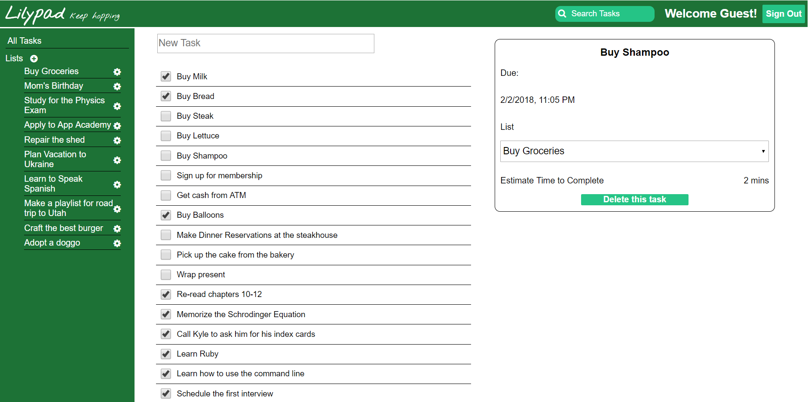

# Lilypad

[Lilypad live][heroku]

[heroku]: http://www.lilypadtodo.com

Lilypad is a full-stack web application that takes cues from
Remember the Milk. Its design allows users to hop from task to task with ease and keep track of what they accomplished. Using this site will allow users to increase their productivity by allowing them to not focus on remembering all of the tasks they need to get done.

## Features & Implementation

### List and Task Rendering and Editing

  The database is responsible for keeping track of the lists and tasks associated with the current user. The table storing the data for the lists contains the columns `id`, `author_id`, `title`, `due`, and `completed`. The table for the tasks works very similarly to the lists table but they have a `list_id` and `author_id` in order to make it easier to fetch all tasks or just the tasks associated with a list. When logged in, the backend will filter the lists and tasks such that only the ones belonging to the current user are available.

  ```ruby
    @lists = current_user.lists
    if @lists
      render :index
    else
  ```
  Lists are rendered only in the navigation bar which appears at the side of the page. The real information lies in the showing of the tasks for each list, which is handled in `TaskIndex`. Above `TaskIndex` is the `ListTitle`, which acts a summarized show page for the currently selected list, including the tile, the estimated time, and how many tasks have been completed. In this component, users can create new tasks with an input field that, when clicked, produces an entire form to collect all of the information for the new task. This helps keep the task_index clean.

  One can see a task merely by clicking on the list element which is labeled with the name of the task. This causes an animated window to come in from the right. The window shows all of the task information, including title, due date/time, and estimated time to completed the task. In this window, the user can edit the title by clicking on it and delete it with the button at the bottom.





### Search

In the header of the page, one can see a green search bar. If you were to type the name of a task in the bar and press return, the task index page will be replaced with the search results of looking for that task in the currently selected list. This is done by filtering the state to include only tasks that include the state search parameters.

```javascript
  let tasks = state.tasks;
  if(ownProps.location.pathname.indexOf("search") >= 0) {
    let allTasks = Object.keys(state.tasks).filter(taskId => taskId !== "errors").map(taskId => state.tasks[taskId]);
    if(state.searchParams){
      tasks = allTasks.filter((task) => (
        task.title.toLowerCase().indexOf(state.searchParams.searchParams.toLowerCase()) >= 0
      ));
    }
  }
```

To look for a list in all of your tasks, simply implement the search while in the all tasks route provided. Keep in mind that the search is case insensitive.
